# 实践报告

## 私有链测试环境搭建

### 编译
```bash
cd /Volumes/workspace/go
git clone git clone git@github.com:ethereum/go-ethereum.git
cd go-ethereum
make geth
```
执行文件会编译到 `./build/bin/` 目录

### 启动
```bash
# 可以把链数据保存下来，下次可以继续使用
mkdir private-chain-data
./build/bin/geth --dev --http --http.api eth,web3,net,miner \
  --http.corsdomain "*" --http.vhosts "*" \
∙ --datadir ./private-chain-data
# 记得记录相关输出
```
运行成功截图
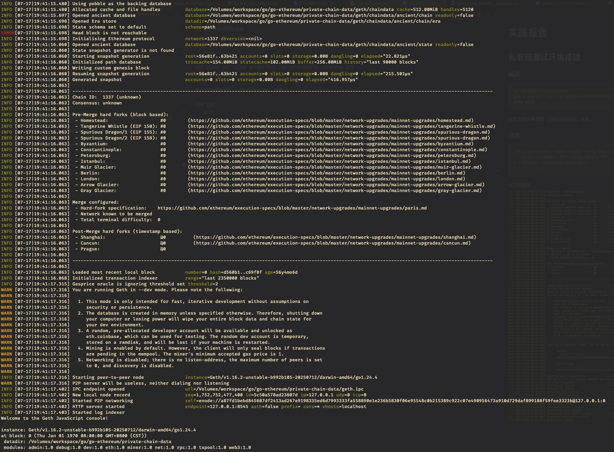

## 钱包设置
### 配置钱包的测试网络
可以在MetaMask中把我们的测试钱包配置进去，这样可以查看余额等信息，同时也可以使用remix连接这个MetaMask钱包进行测试。

RPC地址是我们本地服务启动后的监听地址. 127.0.0.1:8545

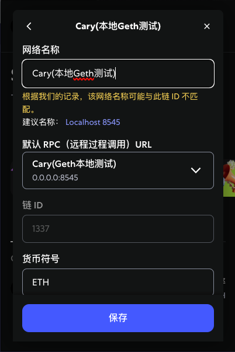


现在可以添加一个钱包账户了

我自己创建了一个测试账户，地址: `0x1c56d98bA446D8ecb5BD5744e85f43028B094D06`，将这个地址添加到钱包中。

下面是添加成功后的截图

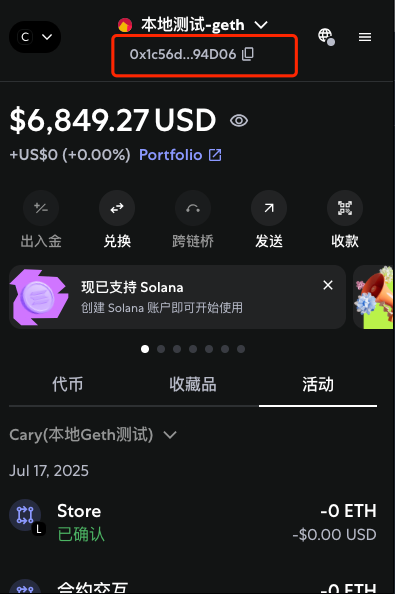


### 执行转账操作
我们的测试钱包目前还没有钱，需要往钱包里面转点钱，方便我们后续部署合约
在命令行中执行下面的命令可以进行转账
```bash
eth.sendTransaction({
  from: eth.accounts[0],
  to: "0x1c56d98bA446D8ecb5BD5744e85f43028B094D06",
  value: web3.toWei(1, "ether"),
  gas: 21000
})
```

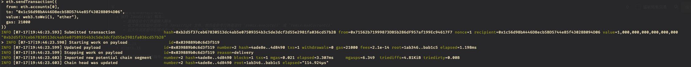

到账了!, 我转账了2次，所以有2个ETH

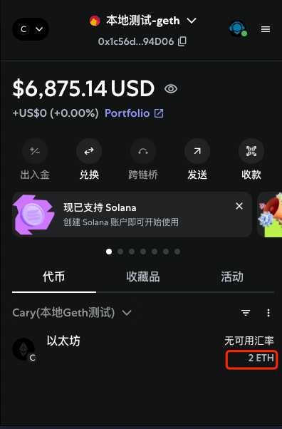

## 部署合约

### 编译合约
打开Redmix，首先编译我们的合约

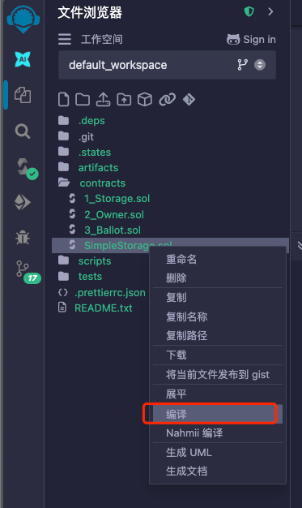

编译完成后，切换到部署 & 发布界面

环境使用Injected Provider - MetaMask

如下图所示

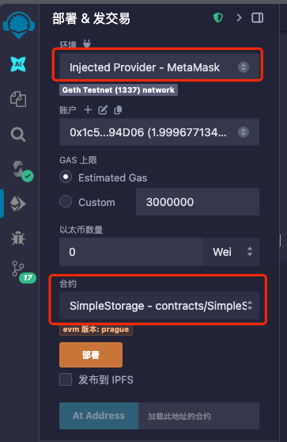

配置好后点击部署

下图是部署完成后的截图
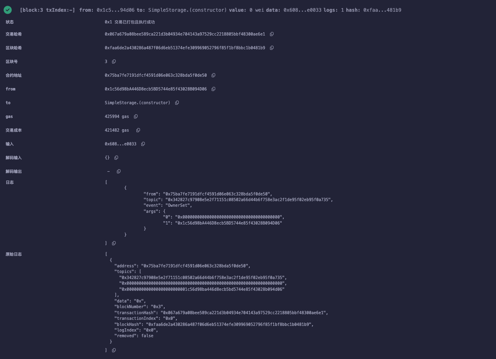

### 执行合约
存储一个数字看看

钱包收到交易请求，准备通过钱包签名调用执行请求给本地区块链网络

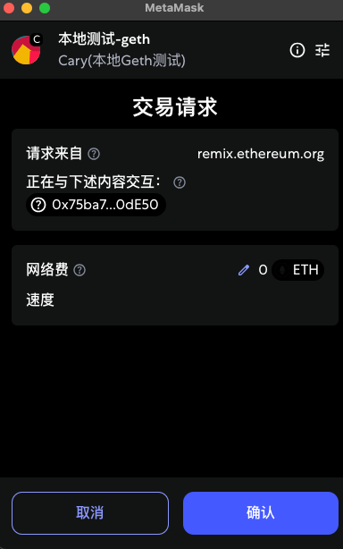

执行合约成功

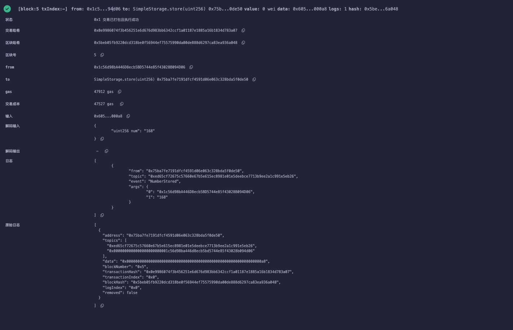


## 查询区块信息

```bash
curl -X POST -H "Content-Type: application/json" \
  --data '{"jsonrpc":"2.0","method":"eth_getBlockByNumber","params":["0x5",true],"id":2}' \
  http://127.0.0.1:8545 | jq
```

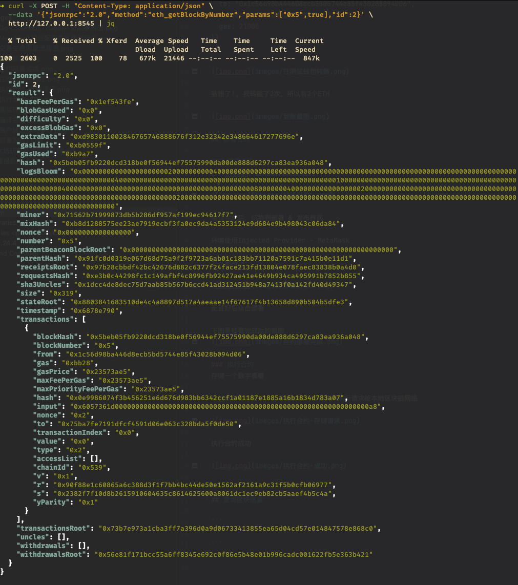

